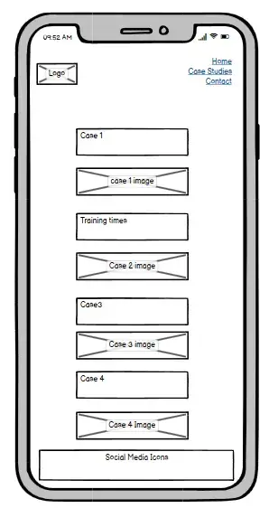

# supun maximus

## Introduction

This website is developed for one of the outstanding upcoming professional fitness trainers, Mr. Supun Dayarathna in Sri Lanka to communicate and engage with its target audience. This document the details technical as well as commercial aspects of the development of the website.


## Project Idea

Since, 2016, Mr Dayathanthe has been in the fitness industry where he has groomed himself as a true professional trainer not only with experience as a trainer but his continued passion for continuous professional development. He is currently reading for his bachelor’s while possessing several diplomas in the subject.  Furthermore, he has been a lecturer in one of the leading educational institutes.

As a trainer, he has helped many individuals, including famous celebrities, kids with special needs, pregnant women, and clients suffering from both sports and non-sports injuries.

The above let Mr Dayarathna to stands out from the rest and it called for a much-needed website to engage with his potential and existing audience. 

## Design for User Experience (UXD)

This section covers a summary of the 5 planes of user experience design. We briefly discuss,

1.	Strategy Plane
2.	Scope Plane
3.	Structure Plane
4.	Skeleton Plane
5.	Surface Plane  

# Strategy Plane

For the site, in this section, we discuss Generic Strategy, target audience, and objectives (both internal and external), as a part of the strategy plane of UXD, 

## Generic Strategy & Differentiation – Niche Marketing 
In line with his uniqueness, the site will support, Supun Maximus to target on high-value and a well-informed specific client base who not only have specific fitness objectives to pursue and looking for a true professional trainer to assist them but also to know what and why they do. 

## Target Audience

In par with the business strategy, the target audience shall be,

- Income – Upper and upper-middle class
- Gender – Male Female
- Education: Well-educated or at least have a sound understating of their subject (e.g.: sportswoman) 
- Age: 13+ (for kids it will be their parents)
- Lifestyle: outgoing & busy lifestyle, fitness enthusiast 
- Geography: within a 20km radius of the training center.
- Profile examples: Professional individuals and couples, celebrities, couples to get married soon, sportsmen and women, Parents of children with special needs, individuals suffering from various injuries, high-class housewives

## Site Objectives

We have looked into the purposes of both the client and the owner of the site for ensuring maximum mileage for both parties. 

For Supun Maximus (site owner), the website is expected to,

1.	Provide relevant, authentic content with authority for fitness enthusiasts 
    - Convey training philosophy
    - Convey his areas of specialization 
    - Provide a convincing message on his capacity as a trainer
    - Training times, location and how to arrange a home visit
    - Technical explanations on tests, movement corrections, rehabilitations, and so on
    - Provide contact information and contact form
    - Social media to get engage with
2.	Reach and getting in touch with potential clients who appreciate the philosophy, willing and able to work with it. 
3.	Share testimonials of clients
4.	Profile building, positioning and differentiating from rest of the competition  

## Purpose of the site – Visitor
- Learn about, Supun
- Training philosophy, areas of services, 
- Do an assessment of the skill set 
- Find out about class schedule and location
- Learn something about Fitness and training
- Build trust and minimize risk
- To know how to get in touch with

# Scope plane

The site will consist of features as follow, in line with the objectives of visitors and the owners.

## Features
For the whole site, 

## Favicon
- Using two letters of Supun Maximus a Favicon is displayed in the browser tab
- This will help a user to easily identify the site among many tab opened in a browse 

    

## Page Title

- A title tag that gives a brief description of the respective page is created for every page to appear on top of the page.
- This will help not the only user to easily understand the content of the page but also appear on the search engine result page (SERP) and help search engine optimization (SEO).

    

### Logo
- A logo is used across the site 
- This will help for both ease of recognition and building the brand image of Supun Maximus
- All the colors used in developing the site have been taken from the logo.
- From any page, if you click on the logo, you will be directed to the home page.

    

### Navigation Bar

- The menu contains access to all three navigational pages
- It is responsive to all devices
- This helps users to navigate to any page on any device.

    

### Footer
- In the footer, we have included social media icons. This allows a visitor to access the social media of Mr Dayarathne or Supun Maximus.
- Use of social media icons that are clearly representational and familiar with well-defined meaning to be a better visual representation and useability  
- Use of aria-label may help visually impaired people as they are used in social media icons.
- In addition, CSS validation and the GitHub name of the developer have been included for further authentication for those who know about the subject (IT)

    

## Landing Page

- The browser will direct the visitor to the landing page when they use a search engine to visit the website. 
- The hero section of the site is used to convey a powerful message to the visitor on his highly committed philosophy and fertility as a personal trainer.
- When prospects analyse the whole page, the content has been developed to boost the confidence of prospective clients and reduce the risk of their buying decision.

    

## Supun Maximus Services
- This area is enriched with services or the specializations of the trainer.
- The section supports the visitor to assess what extent the trainer’s offering matches their expectations
- Furthermore, the selection relevant and authentic set of images and thoughtfully crafted content helped to convince the practical exposure and subject knowledge of Supun Maximus.
- It helps to reduce risk and boost confidence.
- Content is developed using keywords. Therefore, it helps to optimize SEO.

    

## About the Trainer
- The area gives a brief about the experience, education and also the passion for the subject of fitness training. 
- In this case, we have especially used the image to flip the perception to more ease and provide evidence of his academic commitment and authority to perform as a personal trainer.
- Content is developed using keywords and the image has an alt-tag. Therefore, it helps to optimize SEO.
- Image has an alt-tag it will help a visually impaired person, SEO optimization and indexing.

    

## Training Sessions

- We use this section to share his regular training location and timing.
- Again, the image is used to communicate his attentiveness as your potential trainer.
- Client could learn about the location, and training times, and could contact him if they wish to get more information on private sessions
- A Google map is included for ease of navigation to the center.
- Image has an alt-tag it will help a visually impaired person, SEO optimization and indexing

    

## Case Studies
- Case studies provide what Supun Maximus has practically done as a trainer in helping his various clients using his own clients’ images and his commitment to using correct biomechanism in training.
- In addition, a brief has been given on the technicality behind each scenario.
- In par with the owner’s expectation, this section improves his brand image as a qualified trainer.
- A visitor could be able to know about his training philosophy, and know-how.
- In the visitor’s point of view, they may get the sense that they will be on a safe pair of hands.
- Content is developed using keywords and the image has an alt-tag. Therefore, it helps to optimize SEO.
- Image has an alt-tag it will help a visually impaired person, SEO optimization and indexing

    

## Contact Page

- This page provides contact information if the visitor would like to contact him directly or send him a form so that he can contact the client.
- Our client believes the selection of a trainer shall be a rational decision and need to research -knowledge, experience and expertise before deciding on it. Therefore, he has advised us to keep the contact details on the contact page and moreover as it may disturb training sessions.
Accordingly, we have shared the contact details only on the contact page.
- The contact form is so easy to fill
- The contact form consists of mandatory fids of, 
    - First Name
    - Last Name
    - Mobile and 
    - Email
- A visitor has the option to share gender, age and brief on his requirement.
- Importantly, the customer is assured of 24 hours resolution time

    

## Existing Functional Features,
- Responsive design
- Contact form
- Use of Social media icons
- On mobile or tabs, customers can directly call without typing the number separately.
- visitors can use the given email for sending message directly if required

## Existing Non-functional Features
- Simple well-defined navigation
- Simple but consistent web designed for maximizing user experience
- Content and images developed for SEO optimization
- Optimize images for faster functioning of the site
- The site is designed for scalability

## Features to be Implemented
- 404 error page in case of a page could not be found
- Thank you, page, to confirm the receipt of the contact form details
- Introduce casserole for my service area
- Run a blog area on Fitness, conditioning and strengthening	

# Structure Plane

For the site, we propose a tree-based architect for organizing data to facilitate ease of navigation scalability. We ensured that the content is surrounded by sufficient white space. 


# Skeleton Plane
The following components shall be used to give a pleasurable and still objective experience for visitors of the site, 
- Use visual icons
- Apply Progressive disclosure
- Keep the shape of the page the same
- Arrange navigation elements in order of importance
- Maintain 3-4 features per page to maintain useability
- Navigation: rely on a navigation system for browsing 
- Use of representational familiar icons with clear meaning be a better visual representation and useability  
- Ease access & visibility of navigation options
- Consistent navigation and structure across the site

##Information design
-   Designing a contact form that is easy to be filled
- Pleasing design
- Accurate categorization of contents (e.g.: Service provided)
- Use google map for location 
- Use a minimalist approach to designing
- Wireframe

## Wireframe

- Home Page on Desktop

    

- Home page on Mobile

    

- Case study page on Desktop

    

- Case Study page on Mobile

    

- Contact page on Desktop

    

- Contact page on Mobile

    

# Surface Plane
In order to bring a visually appealing experience, we shall use, 
- Colors: Logo colors were picked using adobe color with the mode muted. The selected colors were only used throughout the site. https://color.adobe.com/create/image
 
     

- Fonts 

[Google](https://fonts.google.com/) fonts were used for all Headings and paragraph throughout the site. 

- Layout 

Maintained a consistent layout across the site. It was prioritized to create more whitespace in so that reader will find it easy to read.

- Forms 

As stated above, to gather details and interact with potential client a form has been created.

- Images

All the images were optimized by,

- converting to webp using, [cloud convert](https://cloudconvert.com/webp-converter0 and 
- then, further optimized using, [tinypng](https://tinypng.com/)

- Order/ Sequence

Identity, to ensure economy, readability (legible, contrast, consistency)

The above concludes the UXD section of the website.

# Techno Used

## HTML
The website is structured using Hypertext Markup Language (HTML) as the main language

## CSS
To style, the website, the Cascade Style sheet is used as an external file

## Git Pod 
The website was developed in GitPod

## Git Hub
Hosting of the source codes are on Git hub and Git pages are used to deploy the site


## Font Awesome
The icons used in the footer and contact details were obtained from [Font Awsome](https://fontawesome.com/icons)

## Favicon.io
Favicon is used for browser tabs created using [Favicon](https://favicon.io/favicon-converter/)

## Balsamiq
wireframes were created using [Balsamiq](https://balsamiq.com/wireframes/desktop/#)

## Cava.com
The site logo was created using [canva](http://canva.com)	

## font 
[Google font]( https://fonts.google.com/) was used to have a set of standardised fonts acrros the site.

## images 
Image of the contact form was obtained from [pixbay](https://pixabay.com/photos)

## Keywords 
For identifing key words, [SERanking](https://seranking.com/) was used.

## Check for Code Differances

TO check code variations [Diffchecker]https://www.diffchecker.com/) was used.

## Formating and Indetation of HTML

[Scott Granneman](https://granneman.com/webdev/coding/formatting-and-indenting-your-html) is used as a gudince when formating and indenting HTML

# Testing 

Testing covers will look into Responsiveness, Accessibility, Lighthouse testing, Functional testing, validator testing, and unfixed bugs

## Responsiveness

According to the [WCAG 2.1 Reflow criteria](https://www.w3.org/WAI/WCAG21/Understanding/reflow.html) for responsive design  on Chrome, Edge, Firefox, and Opera browsers, all pages were evaluated to ensure responsiveness on screen sizes starting at 320 pixels and up.

Process of Testing:

1. Launch a browser and go to supun maximus.
2. Go to the developer tools, and (right-click and inspect)
3. Set to responsive, with a 320px reduction in width.
4. 50% Zoom setting
5. Drag the responsive window to its widest point.

#### Expected:

No graphics are distorted or stretched, and the website is responsive across all screen sizes. There is no horizontal scroll. Nothing overlaps, except the horizontal view of some of the browsers.

####Actual:

The website performed as expected. Information is available in Unfixed Bugs.

Moreover, a website was launched on the following

- Apple iphone 11
- Samsug galaxy S22

## Accessibility
[Wave](https://wave.webaim.org/) is used to check for any aid accessibility testing, an accessibility tool was utilized during development and for final testing of the launched website.

The following requirements were tested to make sure they were met:

- All forms contain associated labels or aria-labels so that users who tab to form inputs can hear this information read out on a screen reader.
- The WCAG 2.1 Contrast Guidelines' minimum ratio for colour contrasts is met. Except for one contrast issue in the footer.
- Assure to highlight the significance of the content to a visitor, no heading level is missed or skipped.
- For easy use of assistive technology, every content is with the landmark so that users could easily navigate by page region
- Atl-tags were given to all the non-textual content
- HTML page lang attribute is set
- Aria properties are set correctly
- Accordinglyly, best practices of WCAG 2.1 coding test are followed to a greater extent.

## Lighthouse Testing

### Home Page on a Desktop

   

### Case Studies Page on a Desktop

   

### Contact Page on a Desktop

   

## Functional Testing

### Navigational Testing
By clicking navigation on each of the pages, examined the navigation performance of all the navigation links.


| Navigation Link   | Page to be loaded |
| -----------  | ----------- |
| Hone        | index.html       |
| Case Studies     |case-studies.html |
| Contact       |contact.html |

**Required** : Links to all the pages navigated as expected 

**Actual**: the requirement is met 

### Contact Details Testing

The phone and email of the contact page were tested for their desired functionality 

### Call Testing

Steps, 

1.	Navigate to the contact page, https://pjdevex.github.io/supun-maximus/contact.html
2.	Click on the mobile number given

**Required**: a popup will appear asking to pick up an app to call

**Actual**: the expectation was met 


### Email Testing

Steps, 
1.	Navigate to the contact page, https://pjdevex.github.io/supun-maximus/contact.html
2.	Click on the email given

**Required**: a popup will appear asking to pick up an application to send a message or directed to the default application.

**Actual**: the expectation was met 


### Form Testing

The form on the contact page was manually tested. It performed as expected where required data is skipped or inserted without following the guidance given, will not be allowed to proceed.

**Scenario 1 – Correct Input**
1.	Navigate to Supun Maximus – Contact page https://pjdevex.github.io/supun-maximus/contact.html
2.	Scroll down to the form and insert the below data, 

-       First Name: Peter
        Last Name: Jack
        Mobile: 770 088 586
        Email: peter.jack@test 
        Age Category: 20-34
        Gender: Male
        Message: this is a test
3.	Click submit
4.	User shall be landed in https://formdump.codeinstitute.net/ 

**Required**: Proceed with submission with no warnings and errors to the congratulation page!

**Actual**: requirement was met

**Scenario 2 – Missing Required Field, First Name**

1.	Navigate to Supun Maximus – Contact page https://pjdevex.github.io/supun-maximus/contact.html
2.	Scroll down to the form and inset below deta
-       First Name: 
        Last Name: Jack
        Mobile: 770 088 586
        Email: peter.jack@test 
        Age Category: 20-34
        Gender: Male
        Message: this is a test
3.	Click submit


**Required**: Cannot proceed without the first name for submission, a warning appears

**Actual**: requirement was met

**Scenario 3 – Missing Required Field – Last Name**

1.	Navigate to Supun Maximus – Contact page https://pjdevex.github.io/supun-maximus/contact.html
2.	Scroll down to the form and insert below data
-       First Name: Peter
        Last Name: 
        Mobile: 770 088 586
        Email: peter.jack@test 
        Age Category: 20-34
        Gender: Male
        Message: this is a test
3.	Click submit


**Required**: Cannot proceed without the last name for submission, a warning appears.

**Actual**: requirement was met

**Scenario 4 – Mobile Number in Wrong Format**

1.	Navigate to Supun Maximus – Contact page https://pjdevex.github.io/supun-maximus/contact.html
2.	Scroll down to the form and insert thr below data
-           First Name: Peter
            Last Name: Jack
            Mobile: 0094 770 088 586
            Email: peter.jack@test 
            Age Category: 20-34
            Gender: Male
            Message: this is a test
3.	Click submit


**Required**: Cannot proceed without the correct format of the mobile for submission, a warning appears.

**Actual**: requirement was met


**Scenario 5 – Email in Wrong Format**
1.	Navigate to Supun Maximus – Contact page https://pjdevex.github.io/supun-maximus/contact.html
2.	Scroll down to the form and insert below data
-           First Name: Peter
            Last Name: Jack
            Mobile: 770 088 586
            Email: peter.jack.test 
            Age Category: 20-34
            Gender: Male
            Message: this is a test

3.	Click submit


**Required**: Cannot proceed without the correct format of the email for submission, a warning appears.

**Actual**: requirement was met.

### Google Map
Google map in the training time section was manually clicked

**Required**: Landed in google map with the training center in the middle of the map.

**Actual**: the requirement was met.

### Footer Social Media Links

Social media icons in the footer section, clicked manually to ensure the correct connection to external links. 

**Required**: to proceed to respective social media pages of the client (Supun Maximus) or general page as he does not have twitter or YouTube channel.

**Actual**: the requirement was met.

## Validator Testing

### HTML

No errors were returned when passing through the official [W3C validator](https://validator.w3.org/)

**Index Page HTML Validation**


**Case Studies page HTML Validation**


**Contac Page HTML Validation**


### CSS

No errors were returned when passing through the official [W3C validator](https://validator.w3.org/)


## Deployment

### Version Control
The site as created using git pod and published in git hub to the remote directory “supun-maximus”.

The below git commands were used during the development to push code to the remote repo:

```git add "<file>"``` - To add the file(s) to the staging area before they are committed. <br>

```git commit -m “commit message”``` - To the local repository queue ready for the final step. <br>

``` git push``` - To push all committed code to the remote repository on github. <br>

### Deployment to Github Pages

GitHub pages was used deplyment. 
<br>

The steps to deploy are as follows:
1.	In the GitHub repository, click on the Settings tab
2.	From the menu on left select 'Pages'
3.	From the source section drop-down menu, select the Branch: main
4.	Click 'Save' <br>

A live link is revealed in a green banner once published successfully.
The live link can be found here - https://pjdevex.github.io/supun-maximus/

## Credit

Credit shall go to below for guiding and lending technology to develop the site

### [Flexbox CSS In 20 Minutes](https://www.youtube.com/watch?v=JJSoEo8JSnc)

The video simply and effectivly guides you to use flexbox in styling the content. Most of the areas in the site, where the flex elements were used was based on the above video

### [Create interesting blob shapes with CSS](https://9elements.github.io/fancy-border-radius/)

To convert the logo into a circle, guidence of the above site was used. 

### [How To Add Google Map On Website Using HTML And CSS](https://www.youtube.com/watch?v=4U_AAGHzTok&t=227s)

Guideline of the above vedio was used to insert a google map to the site.

### [Horizontal scroll bar css fix](https://www.youtube.com/watch?v=_Js193O1PAg)
Guide lines of the above video was used to get rid of the horizontal scroll bar of the site.

### [Responsive Contact Us Form in HTML And CSS](https://www.youtube.com/watch?v=eUMqJMkwOBY&t=405s)

To create the contact page design inspirations and codes were barrowed from the mentioned video.

### [W3school](https://www.w3schools.com/default.asp)
It has been a main source of codes for developing the site.

## Content 

All the non-textual media except the background of the contact page, all were obtained from client's social media with his due permission. Fresh textual content was created for the site by factroing key words to them.

## Special Thanks
Special thanks shall go to the client, Mr Dayarathna for his good support, Daisy, my mentor ,and last but not the least to my family for their exceptional care and understanding.